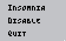

# Insomnia
Keep your "Online" status and don't let your computer sleep with this simple application! It imitates pretty small mouse activity and most programs can handle it like this activity is yours. 

## Installation
You don't need to install the program, so go to Releases page, select the latest release, then click `Insomnia.zip`, open archive whenever you want and it's ready to use! 

## How to use?
 Open the program by running `Insomnia.exe`. To navigate between options use `[↑]` and `[↓]`. 

 

   
 

 You can press `[→]` to enter and `[←]` to exit selected option. 
 After entering an option pressing `[↑]` and `[↓]` will control the option's value.
 After your changes you need to save them, press `[Enter]` to save. Press `[Esc]` or `[←]` to exit without saving changes. Hollow arrow on the left side means that your changes are not saved.
 

   
 
 
 You are free to close this window, it will hide to tray. 

## Tray
 After starting the program, you'll see icon in your tray. Depending on whether program is now imitates activity icon will change its color  
 ### [Active] 
 
  
  
 ### [Inactive] 
  

   
  

 
 By pressing `[LMB]` twice at this icon you can show and hide main window.  
 `[RMB]` at the icon will open the tray menu. In this menu hover and press buttons with your mouse.  
 
 

   
 
  
 
 `[Insomnia]` - open/close the window  
 `[Enable/Disable]` - enable/disable mouse moving  
 `[Quit]` - quit the program  
